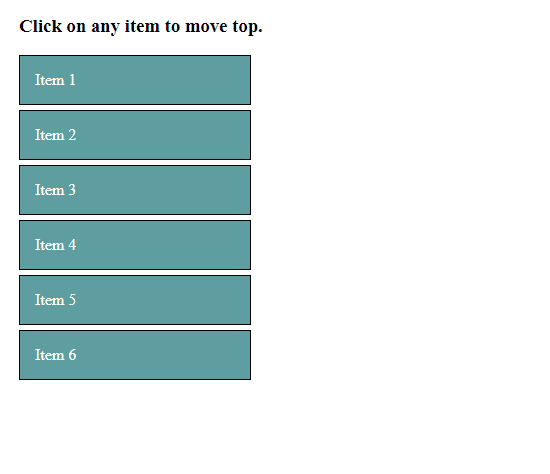

# jQuery-moveToTop
jQuery moveToTop is a light wight plugin which allows to move items to top with animation.
[Demo](http://jquery-movetotop.surge.sh/ "Demo") <br/>

### Getting Started
#### 1 - Installation
in browser
```
<script src="/path/to/jquery.js"></script>
<script src="/path/to/moveToTop.js"></script>
```
#### 2 - Creating HTML
Stack your items in `ul` or `div`
```
<ul class="items-list">
  <li class="item">Item 1</li>
  <li class="item">Item 2</li>
  <li class="item">Item 3</li>
  <li class="item">Item 4</li>
  <li class="item">Item 5</li>
</ul>
```
Or
```
<div class="items-list">
  <div class="item">Item 1</div>
  <div class="item">Item 2</div>
  <div class="item">Item 3</div>
  <div class="item">Item 4</div>
  <div class="item">Item 5</div>
</div>
```
#### 3 - Calling `movetToTop()` Plugin
```
$('.item').on('click', function () {
        $(this).moveToTop({
            target: $('.items-list .item:first-child'),
            speed: 500,
            opacity: 0.8,
            start: function () {
                console.log('Animation Start...');
            },
            end: function () {
                console.log('Animation End...');
            }
        });
    })
```
### Options & Methods
```
$(element).moveToTop({ // element: which element to move top. (mandatory)
    target: this.prev(), // target: where to move element. Default is prevoious element (optional)
    speed: 100, // speed: speed of animation in ms. Default is 1000. (optional)
    opacity: 0.7, // opacity: Set the opacity of moving element. Default is 0.7. (optional)
    start: function () {
        // start: callback called when animation start. Default is empty. (optional)  
    },
    end: function () {
        // end: callback called when animation end. Default is empty. (optional)
    }
});
```
### License
Licensed under the MIT license: http://www.opensource.org/licenses/mit-license.php
